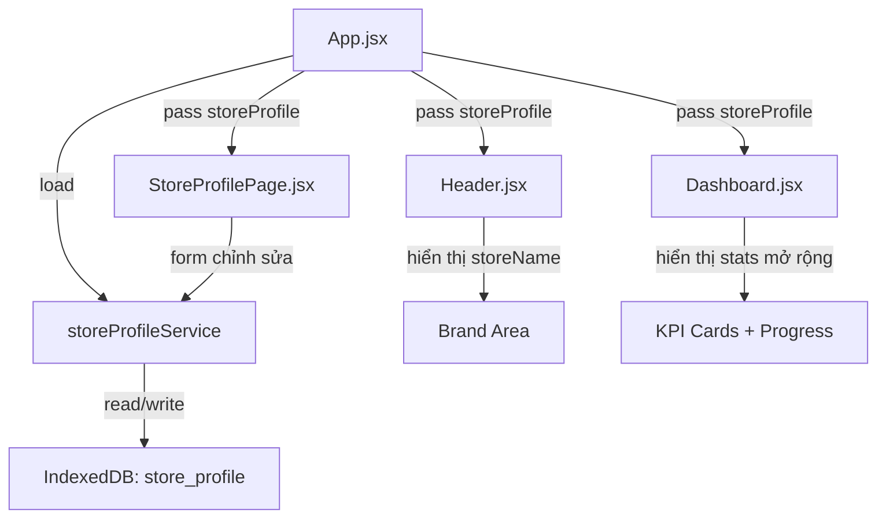

# 📘 Spec Triển Khai: Hồ Sơ Cửa Hàng — Cả 3 Pha

---

## Mục Lục

1. [Tổng Quan Kiến Trúc](#1-tổng-quan-kiến-trúc)
2. [Pha 1 — Core: Thông Tin Cơ Bản](#2-pha-1--core)
3. [Pha 2 — Enrichment: Nâng Cao](#3-pha-2--enrichment)
4. [Pha 3 — Polish: Hoàn Thiện](#4-pha-3--polish)
5. [Tổng Hợp File Thay Đổi](#5-tổng-hợp-file-thay-đổi)

---

## 1. Tổng Quan Kiến Trúc

### Luồng dữ liệu mới



### Nguyên tắc chung
- **Bảng `store_profile`**: Mỗi `owner_username` chỉ có **1 record** duy nhất
- **Backward compatible**: Nếu chưa có profile → hiển thị giá trị mặc định (tên = "JuiceLedger", logo = icon Citrus)
- **Chỉ OWNER mới được chỉnh sửa** store profile, STAFF chỉ xem
- **Tất cả dữ liệu lưu local** trong IndexedDB (không có backend)

---

## 2. Pha 1 — Core

> **Mục tiêu**: Database mới + Service + Trang Hồ Sơ + Tên quán trên Header + Ngày bắt đầu

### 2.1 Database — `src/services/db.js`

**Thay đổi**: Thêm version 5 với bảng `store_profile`

```javascript
db.version(5).stores({
  categories: '++id, name, type, icon, color',
  transactions: '++id, type, category_id, category_name, amount, payment_source, note, transaction_date, created_at',
  users: '++id, &username, passwordHash, pin, fullName, role, phone, email, created_at',
  store_profile: '++id, &owner_username'
});
```

**Seed data**: Thêm vào hàm `seedInitialData()`:

```javascript
const countProfiles = await db.store_profile.count();
if (countProfiles === 0) {
  await db.store_profile.add({
    owner_username: 'admin',
    storeName: '',
    storeSlogan: '',
    storeLogo: null,
    storeAddress: '',
    storePhone: '',
    businessStartDate: '',
    appStartDate: new Date().toISOString().split('T')[0],
    currency: 'VND',
    monthlyRevenueGoal: 0,
    financialMonthStartDay: 1,
    storeNotes: '',
    updated_at: new Date().toISOString()
  });
}
```

### 2.2 Service — `src/services/storeProfileService.js` (file mới)

```javascript
// API Interface:
export const storeProfileService = {
  // Lấy profile theo owner_username, trả về object hoặc null
  async getProfile(ownerUsername) → StoreProfile | null

  // Tạo profile mới (gọi khi register user role OWNER)
  async createProfile(ownerUsername) → StoreProfile

  // Cập nhật profile (partial update, merge fields)
  async updateProfile(ownerUsername, updates) → StoreProfile

  // Lấy hoặc tạo nếu chưa có (convenience method)
  async getOrCreateProfile(ownerUsername) → StoreProfile
}
```

**Chi tiết implementation**:

```javascript
import { db } from './db';

export const storeProfileService = {
  async getProfile(ownerUsername) {
    return await db.store_profile
      .where('owner_username')
      .equals(ownerUsername)
      .first() || null;
  },

  async createProfile(ownerUsername) {
    const profile = {
      owner_username: ownerUsername,
      storeName: '',
      storeSlogan: '',
      storeLogo: null,
      storeAddress: '',
      storePhone: '',
      businessStartDate: '',
      appStartDate: new Date().toISOString().split('T')[0],
      currency: 'VND',
      monthlyRevenueGoal: 0,
      financialMonthStartDay: 1,
      storeNotes: '',
      updated_at: new Date().toISOString()
    };
    const id = await db.store_profile.add(profile);
    return { ...profile, id };
  },

  async updateProfile(ownerUsername, updates) {
    const existing = await this.getProfile(ownerUsername);
    if (!existing) throw new Error('Profile không tồn tại');

    // Validate storeName
    if (updates.storeName !== undefined) {
      const name = updates.storeName.trim();
      if (name.length > 50) throw new Error('Tên cửa hàng tối đa 50 ký tự');
      updates.storeName = name;
    }

    // Validate storePhone
    if (updates.storePhone !== undefined) {
      const phone = updates.storePhone.trim();
      if (phone && !/^[0-9]{9,11}$/.test(phone)) {
        throw new Error('SĐT cửa hàng không hợp lệ');
      }
      updates.storePhone = phone;
    }

    // Validate monthlyRevenueGoal
    if (updates.monthlyRevenueGoal !== undefined) {
      const goal = Number(updates.monthlyRevenueGoal);
      if (isNaN(goal) || goal < 0) throw new Error('Mục tiêu phải là số dương');
      updates.monthlyRevenueGoal = goal;
    }

    updates.updated_at = new Date().toISOString();
    await db.store_profile.update(existing.id, updates);
    return { ...existing, ...updates };
  },

  async getOrCreateProfile(ownerUsername) {
    let profile = await this.getProfile(ownerUsername);
    if (!profile) {
      profile = await this.createProfile(ownerUsername);
    }
    return profile;
  }
};
```

### 2.3 Trang Hồ Sơ — `src/pages/StoreProfilePage.jsx` (file mới)

**Cấu trúc component**:

```
StoreProfilePage
├── Profile Header Card (logo + tên + slogan + địa chỉ)
│   └── [Nút "Chỉnh sửa" → mở StoreProfileEditModal]
├── Thống Kê Hành Trình Card
│   ├── Ngày mở quán: dd/mm/yyyy
│   ├── Ngày dùng app: dd/mm/yyyy (X ngày)
│   ├── Tổng giao dịch: N       ← Pha 1
│   └── Streak ghi sổ: N ngày   ← Pha 2
├── Mục Tiêu Tháng Card          ← Pha 2
│   └── Progress bar
└── Ghi Chú Card                  ← Pha 2
```

**Props**:

```typescript
interface StoreProfilePageProps {
  storeProfile: StoreProfile;
  currentUser: UserSession;
  onUpdateProfile: (updates: Partial<StoreProfile>) => Promise<void>;
  totalTransactions: number;     // từ App.jsx
  // Pha 2:
  currentMonthRevenue?: number;
  streak?: number;
}
```

**Pha 1 — Hiển thị read-only + form chỉnh sửa inline**:

Các trường chỉnh sửa Pha 1:
| Trường | Input type | Validation | Placeholder |
|---|---|---|---|
| `storeName` | text | max 50 chars | "Quán Nước Ép ABC" |
| `storeAddress` | text | max 200 chars | "123 Nguyễn Huệ, Q.1" |
| `storePhone` | tel | 9-11 chữ số | "0901234567" |
| `storeSlogan` | text | max 100 chars | "Tươi ngon mỗi ngày" |
| `businessStartDate` | date | ≤ today | — |

### 2.4 Modal Chỉnh Sửa — `src/components/StoreProfileEditModal.jsx` (file mới)

**Dùng lại pattern** của `ProfileEditModal.jsx`:

```jsx
<div className="modal-overlay" onClick={onClose}>
  <div className="modal-content store-profile-edit-modal" onClick={e => e.stopPropagation()}>
    <div className="modal-header">
      <h3 className="modal-title"><Store size={18} /> Chỉnh Sửa Hồ Sơ Cửa Hàng</h3>
      <button className="icon-btn" onClick={onClose}><X size={18} /></button>
    </div>
    <form className="modal-form" onSubmit={handleSave}>
      {/* 5 trường ở trên */}
      <div className="profile-modal-actions">
        <button type="button" className="btn-secondary" onClick={onClose}>Hủy</button>
        <button type="submit" className="btn-primary"><Save size={15} /> Lưu</button>
      </div>
    </form>
  </div>
</div>
```

### 2.5 Tích Hợp Header — `src/components/Header.jsx`

**Thay đổi**:

```diff
 // Props mới
+ storeProfile,

 // Brand area — thay thế text "JuiceLedger"
- <h1>JuiceLedger</h1>
+ <h1>{storeProfile?.storeName || 'JuiceLedger'}</h1>

 // Drawer brand name
- <span className="drawer-brand-name">JuiceLedger</span>
+ <span className="drawer-brand-name">{storeProfile?.storeName || 'JuiceLedger'}</span>

 // Drawer — thêm nút "Hồ Sơ Cửa Hàng" trong section ĐIỀU HƯỚNG
+ <button
+   className={`drawer-nav-item ${activeTab === 'store-profile' ? 'active' : ''}`}
+   onClick={() => navigate('store-profile')}
+ >
+   <div className="drawer-nav-icon"><Store size={18} /></div>
+   <span>Hồ Sơ Cửa Hàng</span>
+ </button>
```

### 2.6 Tích Hợp App.jsx — `src/App.jsx`

**Thay đổi chính**:

```javascript
// 1. Import mới
import StoreProfilePage from './pages/StoreProfilePage';
import { storeProfileService } from './services/storeProfileService';

// 2. State mới
const [storeProfile, setStoreProfile] = useState(null);

// 3. Load profile khi session thay đổi
useEffect(() => {
  if (session?.user) {
    // Tìm owner username — nếu user là STAFF, dùng 'admin' (owner mặc định)
    const ownerUsername = session.user.role === 'OWNER'
      ? session.user.username
      : 'admin';
    storeProfileService.getOrCreateProfile(ownerUsername)
      .then(setStoreProfile);
  }
}, [session]);

// 4. Handler cập nhật
const handleUpdateStoreProfile = async (updates) => {
  const ownerUsername = session.user.role === 'OWNER'
    ? session.user.username
    : 'admin';
  const updated = await storeProfileService.updateProfile(ownerUsername, updates);
  setStoreProfile(updated);
  showToast('Đã cập nhật hồ sơ cửa hàng', 'success');
};

// 5. Render tab mới
{activeTab === 'store-profile' && (
  <StoreProfilePage
    storeProfile={storeProfile}
    currentUser={session?.user}
    onUpdateProfile={handleUpdateStoreProfile}
    totalTransactions={transactions.length}
  />
)}

// 6. Pass storeProfile vào Header
<Header
  ...
  storeProfile={storeProfile}
/>
```

### 2.7 CSS Pha 1 — thêm vào `dashboard.css`

```css
/* ─────────────────────────────────────────────
   STORE PROFILE PAGE
───────────────────────────────────────────── */
.store-profile-page {
  display: flex;
  flex-direction: column;
  gap: 1.25rem;
}

/* Header card — logo + info */
.sp-header-card {
  display: flex;
  gap: 1.25rem;
  align-items: center;
  padding: 1.5rem;
}

.sp-logo-area {
  width: 80px;
  height: 80px;
  border-radius: var(--radius-lg);
  background: linear-gradient(135deg, var(--primary-100), var(--primary-50));
  display: flex;
  align-items: center;
  justify-content: center;
  flex-shrink: 0;
  font-size: 2.5rem;
  border: 2px dashed var(--border-color);
  transition: var(--transition-normal);
  overflow: hidden;
}

.sp-logo-area img {
  width: 100%;
  height: 100%;
  object-fit: cover;
}

.sp-info {
  flex: 1;
  min-width: 0;
}

.sp-store-name {
  font-size: 1.35rem;
  font-weight: 800;
  color: var(--text-main);
  margin: 0 0 0.25rem;
}

.sp-store-name.placeholder-name {
  color: var(--text-light);
  font-style: italic;
}

.sp-slogan {
  font-size: 0.85rem;
  color: var(--text-muted);
  margin-bottom: 0.5rem;
}

.sp-address {
  font-size: 0.8rem;
  color: var(--text-light);
  display: flex;
  align-items: center;
  gap: 0.35rem;
}

/* Stats / Milestones card */
.sp-milestones {
  display: grid;
  grid-template-columns: repeat(auto-fit, minmax(180px, 1fr));
  gap: 1rem;
  padding: 1.25rem;
}

.sp-milestone-item {
  display: flex;
  align-items: center;
  gap: 0.75rem;
  padding: 0.75rem;
  border-radius: var(--radius-md);
  background-color: var(--bg-main);
}

.sp-milestone-icon {
  width: 40px;
  height: 40px;
  border-radius: var(--radius-sm);
  display: flex;
  align-items: center;
  justify-content: center;
  font-size: 1.2rem;
  flex-shrink: 0;
}

.sp-milestone-label {
  font-size: 0.75rem;
  color: var(--text-muted);
  display: block;
}

.sp-milestone-value {
  font-size: 1rem;
  font-weight: 700;
  color: var(--text-main);
  display: block;
}

/* Store Profile Edit Modal */
.store-profile-edit-modal {
  max-width: 520px;
}
```

### 2.8 Danh Sách File — Pha 1

| File | Hành động | Mô tả |
|---|---|---|
| `src/services/db.js` | **EDIT** | Thêm version 5, seed store_profile |
| `src/services/storeProfileService.js` | **NEW** | CRUD service cho store_profile |
| `src/pages/StoreProfilePage.jsx` | **NEW** | Trang hiển thị + chỉnh sửa hồ sơ |
| `src/components/StoreProfileEditModal.jsx` | **NEW** | Modal form chỉnh sửa |
| `src/components/Header.jsx` | **EDIT** | Hiển thị storeName, thêm nav link |
| `src/App.jsx` | **EDIT** | State, load, handler, routing |
| `src/styles/dashboard.css` | **EDIT** | CSS cho StoreProfilePage |
| `src/styles/mobile.css` | **EDIT** | Responsive cho trang mới |

---

## 3. Pha 2 — Enrichment

> **Mục tiêu**: Logo upload, mục tiêu doanh thu + progress, streak ghi sổ, ghi chú

### 3.1 Upload Logo — `StoreProfileEditModal.jsx`

**Cơ chế**: Dùng `<input type="file" accept="image/*">` → convert sang base64 → lưu vào field `storeLogo` trong IndexedDB.

```javascript
// Xử lý upload
const handleLogoUpload = (e) => {
  const file = e.target.files[0];
  if (!file) return;

  // Validate: chỉ image, max 500KB
  if (!file.type.startsWith('image/')) {
    setError('Chỉ chấp nhận file ảnh');
    return;
  }
  if (file.size > 512000) {
    setError('Ảnh quá lớn (tối đa 500KB)');
    return;
  }

  const reader = new FileReader();
  reader.onloadend = () => {
    // Resize to 200x200 via canvas before storing
    const img = new Image();
    img.onload = () => {
      const canvas = document.createElement('canvas');
      canvas.width = 200;
      canvas.height = 200;
      const ctx = canvas.getContext('2d');

      // Crop center square
      const size = Math.min(img.width, img.height);
      const sx = (img.width - size) / 2;
      const sy = (img.height - size) / 2;
      ctx.drawImage(img, sx, sy, size, size, 0, 0, 200, 200);

      setLogoPreview(canvas.toDataURL('image/jpeg', 0.8));
    };
    img.src = reader.result;
  };
  reader.readAsDataURL(file);
};
```

**UI trong modal**:
```jsx
<div className="sp-logo-upload-area">
  <div className="sp-logo-preview">
    {logoPreview ? (
      
    ) : (
      <Camera size={24} />
    )}
  </div>
  <label className="btn-secondary sp-upload-btn">
    <Upload size={14} />
    <span>Chọn Ảnh</span>
    <input type="file" accept="image/*" hidden onChange={handleLogoUpload} />
  </label>
  {logoPreview && (
    <button type="button" className="btn-text-danger" onClick={() => setLogoPreview(null)}>
      Xóa logo
    </button>
  )}
</div>
```

**Header hiển thị logo**:
```diff
 // Header.jsx — brand-icon
- <div className="brand-icon">
-   <Citrus size={20} color="#FFFFFF" />
- </div>
+ <div className="brand-icon">
+   {storeProfile?.storeLogo ? (
+     
+   ) : (
+     <Citrus size={20} color="#FFFFFF" />
+   )}
+ </div>
```

### 3.2 Mục Tiêu Doanh Thu — `Dashboard.jsx`

**Tính toán progress** (trong `App.jsx` hoặc `Dashboard.jsx`):

```javascript
// Tính % hoàn thành mục tiêu tháng hiện tại
const revenueGoalProgress = useMemo(() => {
  if (!storeProfile?.monthlyRevenueGoal || storeProfile.monthlyRevenueGoal <= 0) return null;
  const goal = storeProfile.monthlyRevenueGoal;
  const current = stats?.totalIncome || 0;
  const percent = Math.min((current / goal) * 100, 100);
  return { goal, current, percent };
}, [storeProfile, stats]);
```

**UI — KPI card mới hoặc section riêng** (đặt dưới grid-kpi):

```jsx
{revenueGoalProgress && (
  <div className="card revenue-goal-card">
    <div className="rg-header">
      <Target size={16} />
      <span>Mục Tiêu Doanh Thu Tháng</span>
    </div>
    <div className="rg-amounts">
      <span className="rg-current">{formatVND(revenueGoalProgress.current)}</span>
      <span className="rg-divider">/</span>
      <span className="rg-goal">{formatVND(revenueGoalProgress.goal)}</span>
    </div>
    <div className="rg-bar-track">
      <div
        className="rg-bar-fill"
        style={{ width: `${revenueGoalProgress.percent}%` }}
      />
    </div>
    <span className="rg-percent">{revenueGoalProgress.percent.toFixed(1)}%</span>
  </div>
)}
```

**CSS**:

```css
.revenue-goal-card {
  padding: 1.25rem;
}

.rg-header {
  display: flex;
  align-items: center;
  gap: 0.5rem;
  font-size: 0.82rem;
  font-weight: 600;
  color: var(--text-muted);
  text-transform: uppercase;
  letter-spacing: 0.03em;
  margin-bottom: 0.75rem;
}

.rg-amounts {
  display: flex;
  align-items: baseline;
  gap: 0.35rem;
  margin-bottom: 0.75rem;
}

.rg-current {
  font-size: 1.3rem;
  font-weight: 800;
  color: var(--primary-500);
}

.rg-divider {
  color: var(--text-light);
}

.rg-goal {
  font-size: 0.95rem;
  color: var(--text-muted);
}

.rg-bar-track {
  height: 10px;
  border-radius: var(--radius-full);
  background-color: var(--bg-main);
  overflow: hidden;
  margin-bottom: 0.5rem;
}

.rg-bar-fill {
  height: 100%;
  border-radius: var(--radius-full);
  background: linear-gradient(90deg, var(--primary-500), #34D399);
  transition: width 0.6s cubic-bezier(0.16, 1, 0.3, 1);
}

.rg-percent {
  font-size: 0.8rem;
  font-weight: 700;
  color: var(--primary-600);
}
```

### 3.3 Streak Ghi Sổ — `src/services/storeProfileService.js`

**Thêm method tính streak**:

```javascript
async calculateStreak() {
  const transactions = await db.transactions
    .orderBy('transaction_date')
    .reverse()
    .toArray();

  if (transactions.length === 0) return 0;

  // Lấy danh sách ngày unique có giao dịch
  const uniqueDates = [...new Set(transactions.map(t => t.transaction_date))].sort().reverse();

  const today = new Date().toISOString().split('T')[0];
  const yesterday = new Date(Date.now() - 86400000).toISOString().split('T')[0];

  // Streak bắt đầu từ hôm nay hoặc hôm qua
  if (uniqueDates[0] !== today && uniqueDates[0] !== yesterday) return 0;

  let streak = 1;
  for (let i = 1; i < uniqueDates.length; i++) {
    const prev = new Date(uniqueDates[i - 1]);
    const curr = new Date(uniqueDates[i]);
    const diffDays = (prev - curr) / 86400000;
    if (diffDays === 1) {
      streak++;
    } else {
      break;
    }
  }
  return streak;
}
```

**Hiển thị** — Thêm vào `StoreProfilePage.jsx` trong section milestones:

```jsx
<div className="sp-milestone-item">
  <div className="sp-milestone-icon" style={{ background: 'rgba(239, 68, 68, 0.1)' }}>
    🔥
  </div>
  <div>
    <span className="sp-milestone-label">Chuỗi ghi sổ liên tiếp</span>
    <span className="sp-milestone-value">{streak} ngày</span>
  </div>
</div>
```

### 3.4 Ghi Chú Cửa Hàng — `StoreProfilePage.jsx`

**UI** — Textarea auto-save (debounce 800ms):

```jsx
const [notes, setNotes] = useState(storeProfile?.storeNotes || '');
const saveTimeoutRef = useRef(null);

const handleNotesChange = (value) => {
  setNotes(value);
  clearTimeout(saveTimeoutRef.current);
  saveTimeoutRef.current = setTimeout(() => {
    onUpdateProfile({ storeNotes: value });
  }, 800);
};

// UI
<div className="card sp-notes-card">
  <h4><StickyNote size={16} /> Ghi Chú Cửa Hàng</h4>
  <textarea
    className="form-textarea sp-notes-textarea"
    placeholder="Ghi nhớ, kế hoạch, hoặc lưu ý cho cửa hàng..."
    value={notes}
    onChange={e => handleNotesChange(e.target.value)}
    rows={4}
    maxLength={1000}
  />
  <span className="sp-notes-counter">{notes.length}/1000</span>
</div>
```

### 3.5 Danh Sách File — Pha 2

| File | Hành động | Mô tả |
|---|---|---|
| `src/components/StoreProfileEditModal.jsx` | **EDIT** | Thêm upload logo |
| `src/components/Header.jsx` | **EDIT** | Hiển thị logo thay Citrus icon |
| `src/pages/Dashboard.jsx` | **EDIT** | Thêm revenue goal progress bar |
| `src/pages/StoreProfilePage.jsx` | **EDIT** | Thêm streak + ghi chú |
| `src/services/storeProfileService.js` | **EDIT** | Thêm calculateStreak() |
| `src/App.jsx` | **EDIT** | Pass thêm props (streak, revenue) |
| `src/styles/dashboard.css` | **EDIT** | CSS cho progress bar, notes, logo upload |

---

## 4. Pha 3 — Polish

> **Mục tiêu**: Thống kê all-time, tháng peak, tiền tệ tùy chỉnh, ngày tháng tài chính

### 4.1 Tổng Giao Dịch All-Time — `Dashboard.jsx`

**Thay đổi `getStats`** trong `storageService.js` — thêm method:

```javascript
async getTotalTransactionCount() {
  await this.init();
  return await db.transactions.count();
}
```

**Hiển thị** — Thêm KPI card thứ 5 hoặc dùng subtitle trong card Lãi Ròng:

```jsx
<KpiCard
  title="TỔNG GIAO DỊCH"
  amount={totalAllTimeTransactions}
  formatAsCurrency={false}
  color="var(--accent-orange-500)"
  badgeText="All-time"
  badgeType="cash"
  subtitle={`Từ ${storeProfile?.appStartDate || '—'}`}
/>
```

### 4.2 Tháng Doanh Thu Cao Nhất — `storageService.js`

**Thêm method**:

```javascript
async getPeakRevenueMonth() {
  await this.init();
  const allTx = await db.transactions
    .where('type').equals('IN')
    .toArray();

  if (allTx.length === 0) return null;

  const monthMap = {};
  allTx.forEach(t => {
    const monthKey = t.transaction_date.substring(0, 7); // "2025-08"
    monthMap[monthKey] = (monthMap[monthKey] || 0) + Number(t.amount);
  });

  let peakMonth = null;
  let peakAmount = 0;
  for (const [month, amount] of Object.entries(monthMap)) {
    if (amount > peakAmount) {
      peakAmount = amount;
      peakMonth = month;
    }
  }

  if (!peakMonth) return null;

  const [y, m] = peakMonth.split('-');
  return {
    label: `T${parseInt(m)}/${y}`,
    amount: peakAmount
  };
}
```

**Hiển thị** — Trong `StoreProfilePage.jsx` milestones:

```jsx
{peakMonth && (
  <div className="sp-milestone-item">
    <div className="sp-milestone-icon" style={{ background: 'rgba(234, 179, 8, 0.1)' }}>
      👑
    </div>
    <div>
      <span className="sp-milestone-label">Tháng doanh thu cao nhất</span>
      <span className="sp-milestone-value">
        {peakMonth.label} — {formatVND(peakMonth.amount)}
      </span>
    </div>
  </div>
)}
```

### 4.3 Đơn Vị Tiền Tệ Tùy Chỉnh

**Scope ảnh hưởng**: Mọi nơi dùng `formatVND()` hoặc `Intl.NumberFormat('vi-VN', { currency: 'VND' })`.

**Cách tiếp cận**: Tạo utility function trung tâm:

```javascript
// src/utils/currency.js (file mới)
export function createCurrencyFormatter(currency = 'VND') {
  const locale = currency === 'VND' ? 'vi-VN' : 'en-US';
  return (value) =>
    new Intl.NumberFormat(locale, {
      style: 'currency',
      currency,
      maximumFractionDigits: currency === 'VND' ? 0 : 2,
    }).format(value || 0);
}
```

**File cần sửa**:
| File | Nơi dùng format tiền |
|---|---|
| `Dashboard.jsx` | `formatVND()` ở dòng 14 |
| `KpiCard.jsx` | `Intl.NumberFormat` ở dòng 5 |
| `TransactionList.jsx` | Format amount trong danh sách |

**Cách truyền**: `App.jsx` tạo formatter từ `storeProfile.currency` → pass xuống qua props hoặc React Context.

```javascript
// App.jsx
const formatCurrency = useMemo(
  () => createCurrencyFormatter(storeProfile?.currency || 'VND'),
  [storeProfile?.currency]
);
```

### 4.4 Ngày Bắt Đầu Tháng Tài Chính

**Ảnh hưởng**: Hàm `getDateRangeFilter()` trong `App.jsx`.

**Thay đổi logic khi `rangeType === 'MONTH'`**:

```javascript
if (dateRange.rangeType === 'MONTH') {
  const startDay = storeProfile?.financialMonthStartDay || 1;
  const now = new Date();

  let startDate, endDate;
  if (now.getDate() >= startDay) {
    // Tháng tài chính hiện tại: startDay tháng này → startDay-1 tháng sau
    startDate = new Date(now.getFullYear(), now.getMonth(), startDay);
    endDate = now;
  } else {
    // Tháng tài chính hiện tại bắt đầu từ startDay tháng trước
    startDate = new Date(now.getFullYear(), now.getMonth() - 1, startDay);
    endDate = now;
  }

  return {
    startDate: startDate.toISOString().split('T')[0],
    endDate: endDate.toISOString().split('T')[0]
  };
}
```

**UI chỉnh sửa** — Trong `StoreProfileEditModal.jsx`:

```jsx
<div className="form-group">
  <label className="form-label">Ngày Bắt Đầu Tháng Tài Chính</label>
  <select
    className="form-select"
    value={financialMonthStartDay}
    onChange={e => setFinancialMonthStartDay(Number(e.target.value))}
  >
    {[1, 5, 10, 15, 20, 25].map(d => (
      <option key={d} value={d}>Ngày {d} hàng tháng</option>
    ))}
  </select>
  <span className="field-hint">
    Ví dụ: nếu chọn ngày 15, tháng tài chính sẽ tính từ 15 tháng trước đến 14 tháng này
  </span>
</div>
```

### 4.5 Danh Sách File — Pha 3

| File | Hành động | Mô tả |
|---|---|---|
| `src/utils/currency.js` | **NEW** | Currency formatter utility |
| `src/services/storageService.js` | **EDIT** | getTotalTransactionCount, getPeakRevenueMonth |
| `src/pages/Dashboard.jsx` | **EDIT** | KPI all-time, dùng formatCurrency |
| `src/pages/StoreProfilePage.jsx` | **EDIT** | Tháng peak, dùng formatCurrency |
| `src/components/KpiCard.jsx` | **EDIT** | Nhận formatCurrency qua props |
| `src/components/TransactionList.jsx` | **EDIT** | Dùng formatCurrency |
| `src/components/StoreProfileEditModal.jsx` | **EDIT** | Thêm currency select, financial month start |
| `src/App.jsx` | **EDIT** | Tạo formatter, sửa getDateRangeFilter |

---

## 5. Tổng Hợp File Thay Đổi

### File Mới (4 file)

| File | Pha | Vai trò |
|---|---|---|
| `src/services/storeProfileService.js` | 1 | CRUD cho store_profile |
| `src/pages/StoreProfilePage.jsx` | 1 | Trang hồ sơ cửa hàng |
| `src/components/StoreProfileEditModal.jsx` | 1 | Modal chỉnh sửa |
| `src/utils/currency.js` | 3 | Format tiền tệ tùy chỉnh |

### File Chỉnh Sửa (8 file)

| File | Pha 1 | Pha 2 | Pha 3 | Tổng lần sửa |
|---|:---:|:---:|:---:|:---:|
| `src/services/db.js` | ✅ | | | 1 |
| `src/components/Header.jsx` | ✅ | ✅ | | 2 |
| `src/App.jsx` | ✅ | ✅ | ✅ | 3 |
| `src/styles/dashboard.css` | ✅ | ✅ | | 2 |
| `src/styles/mobile.css` | ✅ | | | 1 |
| `src/pages/Dashboard.jsx` | | ✅ | ✅ | 2 |
| `src/services/storageService.js` | | | ✅ | 1 |
| `src/components/KpiCard.jsx` | | | ✅ | 1 |
| `src/components/TransactionList.jsx` | | | ✅ | 1 |

### Ước Tính Khối Lượng

| Pha | File mới | File sửa | Độ phức tạp | Ước tính LOC mới |
|---|---|---|---|---|
| **Pha 1** | 3 | 5 | Trung bình | ~450 LOC |
| **Pha 2** | 0 | 7 | Trung bình | ~350 LOC |
| **Pha 3** | 1 | 6 | Cao (refactor currency toàn app) | ~300 LOC |
| **Tổng** | **4** | — | — | **~1100 LOC** |

---

> [!IMPORTANT]
> **Bước tiếp theo**: Nhấn **Proceed** để tôi bắt đầu triển khai từ **Pha 1**. Hoặc cho tôi biết nếu bạn muốn điều chỉnh spec trước khi code!
